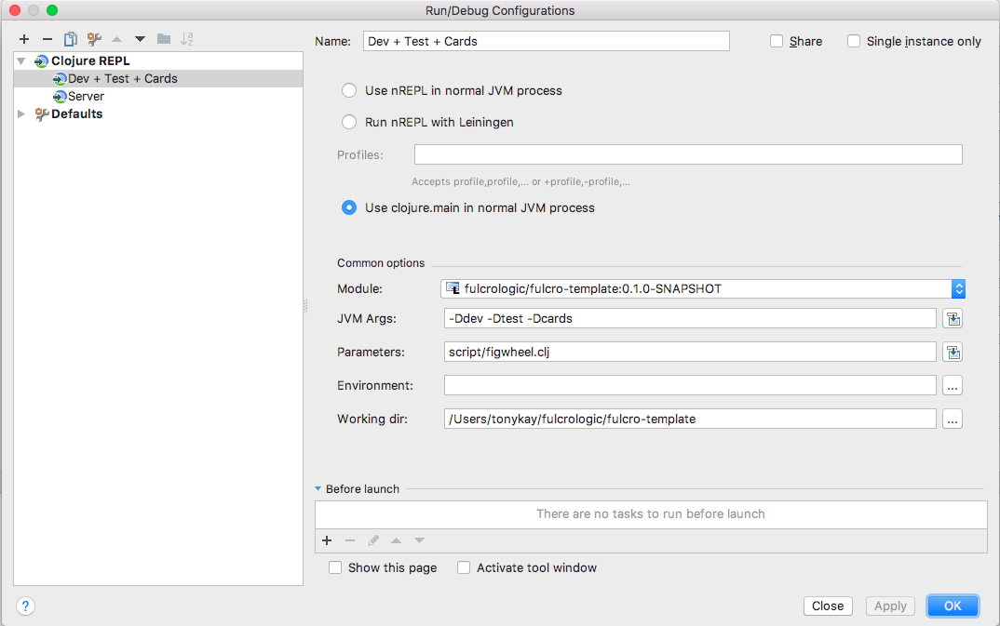
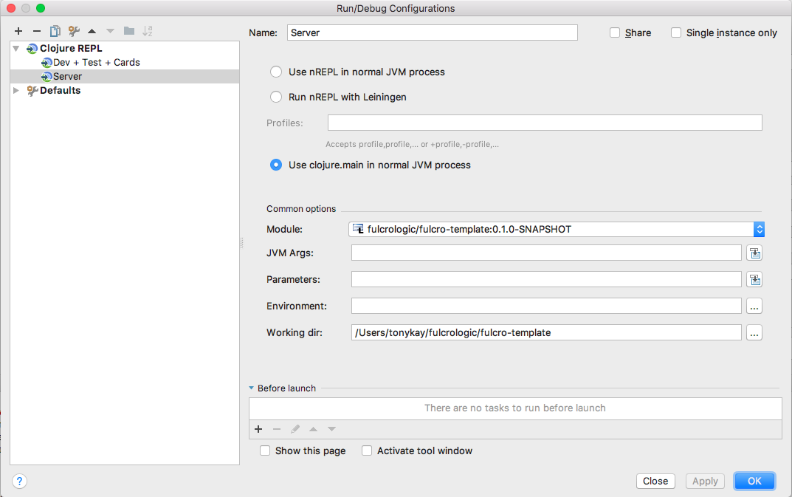

# Template

This is a Full Stack template with specs, dev cards, and client code.
It contains a mock login/signup screen, top-level tab routing (once logged in), etc.

You must run the server (and use it through the server) for login to work. The server always approves login.

You can login with `tony@nowhere.com` or `joe@nowhere.com`, the password is `letmein`.


It is set up to be deployable to Heroku (or anywhere) as a standalone jar.

Master: </img>
Develop: </img>

## Features

The app supports a fake user database (see `valid-users` in `src/main/fulcro_template/api/mutations.clj`)
with two users. HTML5 Routing is configured, and the routing tree and BIDI config
are in `html5_routing.cljs`.

The server has been set up with a session store, and the login
mutations show you how you can access and modify it (see `mutations.clj`). The
server has also been configured to serve the same index page for all URI requests
of HTML, so that the browser can decide what to show based on the URI in
app logic. See `server.clj` for details of the augmented Ring pipeline.

The HTML5 routing is smart enough to know where you wanted to go. It
remembers the URI that came in on load. If you're already logged in, it
will start the UI in the place. If you have to login, it will redirect
you to your desired page after login.

## Contents

```
├── Makefile                    Convenience targets
├── Procfile                    Sample Heroku deployment file
├── dev
│   ├── client
│   │   └── cljs
│   │       └── user.cljs       REPL helpers and entry point for cljs dev mode
│   └── server
│       └── user.clj            REPL functions for starting server and cljs builds
├── package.json                NODE config, used for running CI cljs tests
├── project.clj
├── resources
│   └── public (NOTE: no HTML needed for app anymore, using server-side rendering!)
│       ├── cards.html          Devcards HTML page
│       ├── css
│       │   ├── edn.css         CSS files for rendering specs in browser
│       │   └── test.css
│       └── cards.html          Devcards HTML file
├── script
│   └── figwheel.clj            CLJ script for starting figwheel automatically
├── bin
│   └── rename-project.sh       A script you can use to rename the project and packages
├── package.json                User for CI testing via Node
├── project.clj                 The project file
├── script
│   └── figwheel.clj            A clojure script for starting figwheel on build(s)
├── src
│   ├── cards
│   │   └── fulcro_template  Devcards
│   │       ├── cards.cljs
│   │       └── intro.cljs
│   ├── main                         The Main Source Folder
│   │   ├── config
│   │   │   ├── defaults.edn         The server config defaults
│   │   │   ├── dev.edn              The server config for dev mode
│   │   │   └── prod.edn             A SUGGGESTED production config for Heroku
│   │   └── fulcro_template
│   │       ├── api
│   │       │   ├── mutations.clj    The server-side implementation of mutations
│   │       │   ├── mutations.cljs   The client-side impl of mutations
│   │       │   ├── read.clj         Server-side read handlers
│   │       │   └── user_db.clj      Simulated in-RAM user database
│   │       ├── locales
│   │       │   └── es.cljc          Spanish locale (see README-i18n.md)
│   │       ├── client.cljs          The creation of the client instance
│   │       ├── client_main.cljs     The production main for client
│   │       ├── server.clj           The creation of the server
│   │       ├── server_main.clj      The production main for server
│   │       └── ui
│   │           ├── components.cljc     Sample UI placeholder component
│   │           ├── html5_routing.cljc  Full-blown HTML5 routing with bidi/pushy
│   │           ├── login.cljc          The login screen
│   │           ├── main.cljc           The placeholder main screen
│   │           ├── new_user.cljc       The placeholder new user screen (doesn't submit to server)
│   │           ├── preferences.cljc    The placeholder preferences screen
│   │           ├── root.cljc           The UI root
│   │           └── user.cljc           A representation of User for login
│   └── test
│       └── fulcro_template
│           ├── CI_runner.cljs          The entry point for CI testing
│           ├── client_test_main.cljs   The entry point for dev-mode testing
│           ├── sample_spec.cljc        A sample client/server spec
│           └── tests_to_run.cljs       Client-side requires for all spec files (so they get loaded)
```

## Setting up Run Configurations (IntelliJ)

Add a figwheel config:



Add a server config:



Then run *both* from IntelliJ.

## Using from other editors

See the Makefile for useful command-line targets, which are useful for
when working from a lower-level system editor.

The simplest approach is to start a REPL:

```
JVM_OPTS=-Ddev lein repl
```

*You will need two REPLs*: one for the server, and one for you dev builds of the client.

There is a pre-supplied function named `start-figwheel` that will start the cljs builds and figwheel hot code push.

```
(start-figwheel [:test :dev :cards])
```

## Using the server

IMPORTANT: When work in development mode, be sure to pass the
JVM option `-Ddev`. This will ensure the HTML5 service sends the
right page.

In the server REPL, start the server with:

```
(go)
```

To reload the server code:

```
(restart)
```

IF your compile fails, Recompile after failed compile:

```
(tools-ns/refresh)
(go)
```

## Using the Full Stack App (dev mode)

Open a browser on:

```
http://localhost:3000/index-dev.html
```

## Dev Cards (once figwheel is running)

Open a browser on:

```
http://localhost:3449/cards.html
```

## Client Tests (once figwheel is running)

Open a browser on:

```
http://localhost:3449/fulcro-spec-client-tests.html
```

Now edit `sample-spec.cljc` and save. The tests will update automatically.

See the docs on http://github.com/fulcrologic/fulcro-spec for directions on
using things like selectors!

## Server Tests

The server tests can be run from a console, or even better: rendered
live in a browser.

### Server Tests from a Console

The test-refresh plugin will render the results, and refresh them on saves:

```
lein test-refresh
```

### Server Tests in a Browser

This runs the tests in a JVM, but uses a websocket to push the results
to a web UI. This is much more powerful, but requires you start another
server:

```
$ lein repl
user=> (start-server-tests)
```

Then access the test UI at:

```
http://localhost:8888/fulcro-spec-server-tests.html
```

Now edit `sample-spec.cljc` and save. The tests will update within milliseconds!

## Continuous Integration Tests

The project is set up to be able to run both the UI and Server tests from a
standard *NIX command-line (untested with Windows, but works with OSX and
Linux).

The UI tests use node, karma, and doo to accomplish tests.

The Makefile has targets for running the various CI tests modes. You
must install Node and NPM. In OSX, Home Brew can make quick work of that.

## Makefile

There is a GNU `Makefile` in the project that can start various command
line interactions. This file is commented so you can see what targets
are valid.

Example: Run a REPL that is ready to run the Fulcro Server:

```
make server
```

# Deploying

Build the standalone Jar with:

```
lein uberjar
```

will build `target/fulcro_template.jar`.

The production `prod.edn` file (in src/config) grabs the web PORT from
the environment (as required by Heroku). So, this jar can be run with:

```
export PORT=8080   # the web server port to use
java -Dconfig=config/prod.edn -jar fulcro_template.jar
```

The `Procfile` gives the correct information to heroku, so if you've
configured the app (see Heroku docs) you should be able to deploy with
git:

```
git push heroku master
```
